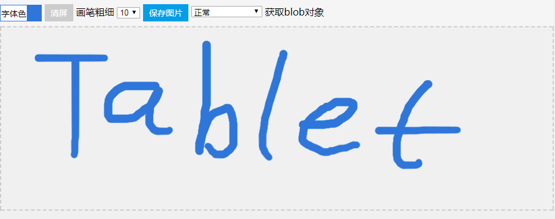

# Tablet
Tablet是一个基于canvas的在线签名板！
<h1>canvas签名板文档</h1>
  <h2>基本使用</h2>
  <pre>
      <code class="javascript">
  　　　　&lt;div id="my_tablet"&gt;&lt;/div&gt;
          &lt;script type="text/html" id="temp"&gt;
             &lt;span&gt;
                 画笔粗细
                 &lt;select&gt;
                     &lt;option value="1"&gt;1&lt;/option&gt;
                     &lt;option value="3"&gt;3&lt;/option&gt;
                     &lt;option value="5"&gt;5&lt;/option&gt;
                     &lt;option value="8"&gt;8&lt;/option&gt;
                     &lt;option value="10" selected&gt;10&lt;/option&gt;
                     &lt;option value="15"&gt;15&lt;/option&gt;
                     &lt;option value="20"&gt;20&lt;/option&gt;
                 &lt;/select&gt;
                 &lt;span class="save-canvas-to-img"&gt;
                     保存图片
                 &lt;/span&gt;
                 &lt;select&gt;
                     &lt;option value="0"&gt;正常&lt;/option&gt;
                     &lt;option value="90"&gt;顺时针旋转90度&lt;/option&gt;
                     &lt;option value="-90"&gt;逆时针旋转90度&lt;/option&gt;
                     &lt;option value="180"&gt;旋转180度&lt;/option&gt;
                 &lt;/select&gt;
                 &lt;span class="get_blob"&gt;获取blob对象&lt;/span&gt;
             &lt;/span&gt;
         &lt;/script&gt;
         &lt;script&gt;
            var tablet = new Tablet("#my_tablet",{
              // 默认字体颜色
              defaultColor: "#2e76da",
              // 是否允许选择字体颜色
              selectColor: true,
              /* canvas画布是否响应式，默认为true。当设置为响应式后浏览器大小改变后会重新计算canvas画布的宽高，
              并且之前绘制的内容会被清除掉（canvas的一个特性）*/
              response: true,
              // canvas的宽度，宽度可以传递函数。不传宽度默认为canvas的父元素的宽度
              width: 0,
              // canvas的宽度，高度可以传递函数。不传宽度默认为canvas的父元素的高度
              height: 0,
              // 签名板的额外class
              extraClass: "",
              // 清屏按钮的innerHTML
              clearBtnHtml: "",
              // 保存图片的innerHTML
              saveBtnHtml: "",
              // 工具栏中额外的html（可以实现一些自定义功能）
              otherHtml: $("#temp").html(),
              // tablet初始化后执行的函数（此时canvas上下文并未初始化）
              onInit: function (){
                  var that = this,
                      container = this.container;
                  container.find("select").eq(0).on("change", function (){
                      that.setLineWidth($(this).val());
                  });
                  container.find("select").eq(1).on("change", function (){
                      that.rotate($(this).val());
                  });
                  container.find(".save-canvas-to-img").on("click", function (){
                      that.getBase64();
                  });
                  container.find(".get_blob").on("click", function (){
                      that.getBlob();
                  });
                  /*container.find(".download").on("click", function (){
                      document.getElementById("preview_img").src = that.getBase64();
                  });*/
              },
              // 清除画布前执行的函数，如果该函数返回false，则不会进行清除
              onBeforeClear: function() {},
              // 清除画布后执行的函数
              onClear: function() {}
          });
        &lt;/script&gt;
      </code>
  </pre>
  
效果如图：

  
  

  <h2>实例方法</h2>
  <blockquote>
      clear
  </blockquote>
  
<code>clear()</code>方法用于清空画布。返回值为当前Tablet实例

  <blockquote>
      getBase64
  </blockquote>
  

    <code>getBase64(type)</code>获取画布的base64数据，拿到的是base64字符串。
    <code>type</code>参数为图片类型，可选值有jpg、png，默认png
  

  <blockquote>
      getBlob
  </blockquote>
  

    <code>getBlob(type)</code>获取画布的Blob数据（二进制数据），返回的是Blob对象。（内部实现：先获取base64字符串，再转换成Blob对象）
    <code>type</code>参数为图片类型，可选值有jpg、png，默认png
  

  <blockquote>
      canvasReset
  </blockquote>
  

    <code>canvasReset()</code>该方法可以用来重置canvas画布的属性。重置只会重置canvas的lineWidth、strokeStyle、lineCap、lineJoin、shadowBlur、shadowColor属性
  

  <blockquote>
      rotate
  </blockquote>
  

    <code>rotate(degree)</code>旋转画布。degree为旋转的角度，可选角度为90、-90、180、-180
  

  <blockquote>
      setCanvasWH
  </blockquote>
  

    <code>setCanvasWH(width, height)</code>设置签名板的宽高。如果不传递宽高、或只传递了宽或高则会使用canvas的父容器的宽高。在移动端中签名板的宽高默认为window的宽高，这样做是为了在移动端中更好的进行写字。
    

      <b>注意：</b>手动设置签名板的宽高（或旋转画布）后canvas之前绘制的内容会被清除掉。
    

  

  <blockquote>
      setColor
  </blockquote>
  

    <code>setColor(color)</code>设置canvas画笔的颜色。<code>color</code>为画笔颜色，默认为：#000。它的值可以为css表达颜色的值
  

  <blockquote>
      setLineWidth
  </blockquote>
  

    <code>setLineWidth(width)</code>设置canvas画笔的粗细。<code>width</code>为画笔粗细，pc端默认为8，移动端根据屏幕大小自动判断
  

  

   
  <h2>实例属性</h2>
  <blockquote>
      id
  </blockquote>
  
该id为当前签名板元素的id，可通过该id获取到当前签名板

  <blockquote>
      $canvas
  </blockquote>
  
通过jQuery获取到的当前签名板的canvas元素

  <blockquote>
      canvas
  </blockquote>
  
当前签名板的canvas dom元素

  <blockquote>
      ctx
  </blockquote>
  
当前签名板的canvas的上下文

  <blockquote>
      point
  </blockquote>
  
签名板最后一次绘制时的坐标

   
  <h2>演示地址</h2>
  <h3>https://941477276.github.io/Tablet</h3>
   
   
   

